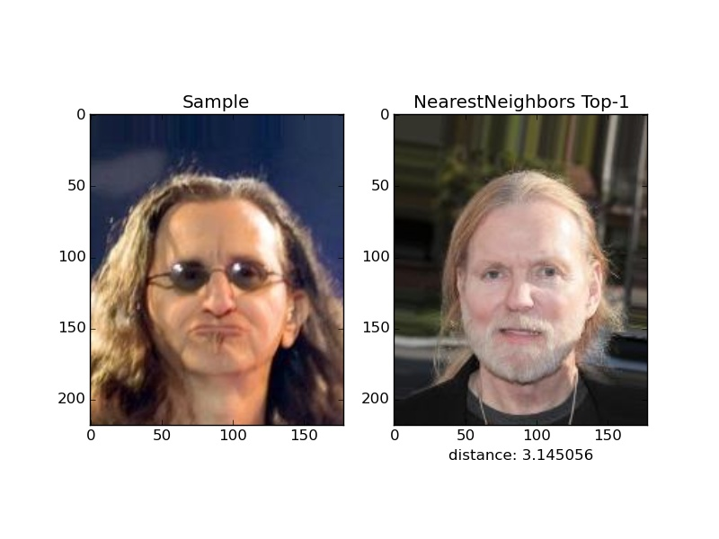

# face
DCGANs for face.

## train descriminator and generator.
```
python task.py
```
## train reverser.
```
python task_reverser.py
```
## generate a vector from an image
```
python sampling_reverse.py <an image path or a file include images path>
```

# samples

## random samples


## smooth samples


## similarity noize vectors





``
